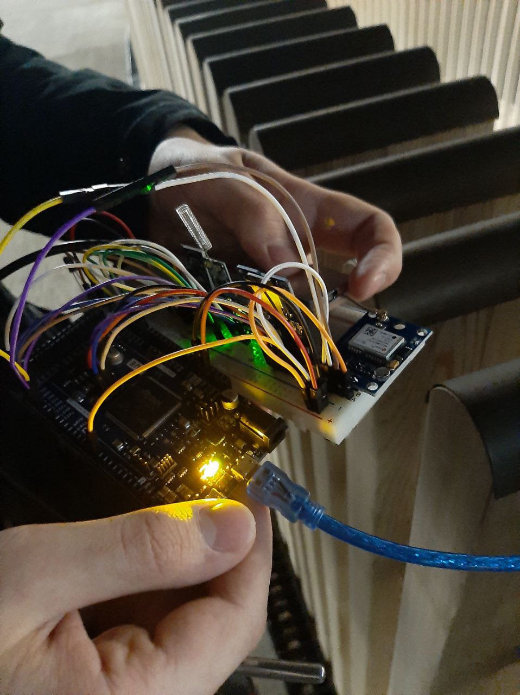
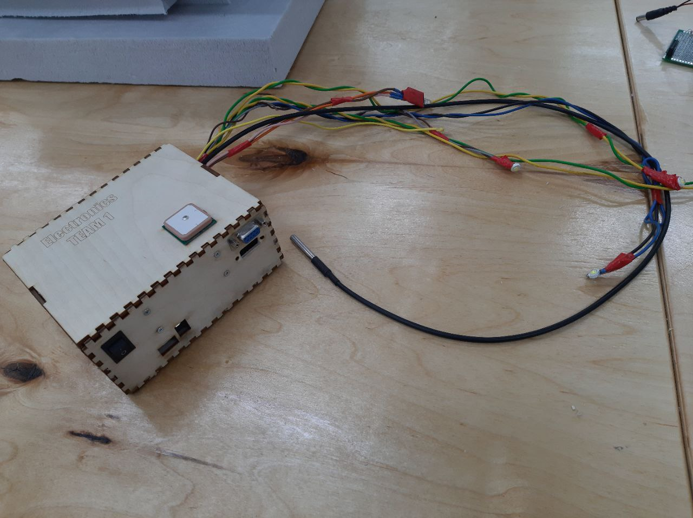

# geliostat-1

## System Engineering stratosphere ballon project

* IDE: Arduino IDE
* Microcontroller: Arduino Due
* Periphereals: GPS, 2xTemperature sensors (1-wire), 10-dof IMU module, piezoelectric speaker, SPI SD card reader.

| Prototype                                                                  | Module                                                               |
| -------------------------------------------------------------------------- | -------------------------------------------------------------------- |
|  |  |

See 'data/' directory for more information about the project.
